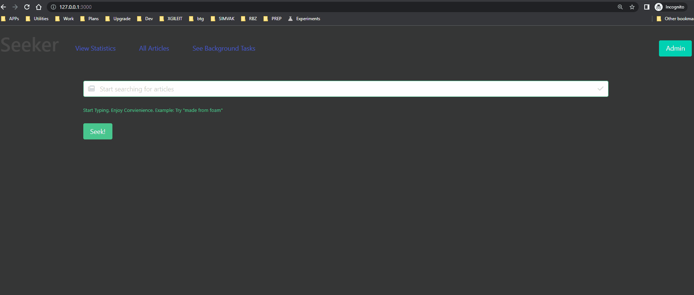

# Seeker Search-Analytics challenge project 

Welcome to seeker ! A search analytics project for articles. The features of the project is to build a search application for Articles where you can see the search trends from other users.
## Features

- Fast Search with realtime recording and analytics per user/search query
- Background Processing with sidekiq and Redis
- Cool Analytics
- Test Driven Development
- Scalable
- Clean Code

## Search Model

- Redis is used for the background processing of the search queries.
- Full Text Search in Milliseconds with ts_vector and ts_query using a stored generated program.
- The search model has a validation for the search query. With simple Natural Language Processing (NLP) to check if the search query is a question or a sentence. If the search query is a question the search query is saved in the database. If the search query is a sentence the search query is not saved in the database.

## Images

## Built and tested With

- Ruby 2.7.2
- Ruby on Rails 7
- Rspec
- Postgres: >=9.5
- Docker
- Redis
- Sidekiq
- Bulma CSS
  
## Live demo link

Visit the live demo [link](https://seeker-search-analytics.herokuapp.com/)

## Setup

Download the repo with this command

`git clone git@github.com:simandebvu/seeker.git`

`cd seeker`

`git checkout development` 

Start the containers for DB and Redis

`docker-compose up --build`

Install the Gems and Dependencies

`bundle install`

Migrate the database and models

`rails db:create`
`rails db:migrate`
`rails db:seed`

Start Sidekiq

`bundle exec sidekiq`

## For the usage

Run the server

`rails server`

Open in the browser `http://localhost:3000/`

## Run the test 

Run this command

`bundle exec rspec`

## Author

👤 **Shingirayi Mandebvu**

- GitHub: [@simandebvu](https://github.com/simandebvu)
- Twitter: [@simandebvu](https://twitter.com/simandebvu) 
- LinkedIn: [Shingirayi Mandebvu](https://www.linkedin.com/in/simandebvu/) 

## 🤝 Contributing

Contributions, issues and feature requests are welcome!

Feel free to check the [issues page](https://github.com/simandebvu/seeker/issues).

## Show your support

Give a ⭐️ if you like this project!

## Acknowledgments

- Project inspired and challenged by HelpJuice.

## 📝 License

This project is [MIT](https://opensource.org/licenses/MIT) licensed.

